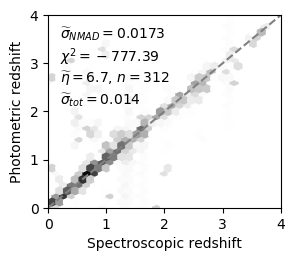
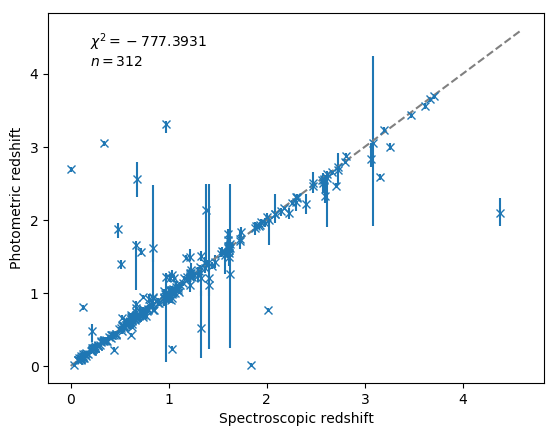
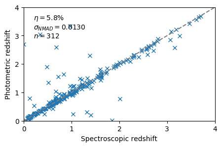

======================================================
Evaluating photo-z redshift estimators
======================================================

Measuring redshifts for galaxies is fundamental to know their distances
and therefore intrinsic luminosity. For most galaxies, redshifts are 
estimated from fitting of photometric data (photo-z method) using 
various methods (template fitting, machine learning, hybrid methods).

To compare different methods, two quantities are used:
1) The redshift error (scatter of the redshift guess around the correct answer)
2) The outlier rate (how often the estimated redshift is completely off).
Modern methods provide probability distributions to quantify the 
redshift uncertainty (PDZ). However, these are often overly confident (too peaky).

This project implements a fair method for comparing methods 
by their PDZ, incorporating systematic errors and quantifying 1) and 2).

Method
--------

The PDZ is smoothened with a gaussian kernel of width k 
(for scatter around the best guess) and 
a plateau of f_outlier is added (for the outlier fraction).
The PDZ is normalised, and the probability values at the places of the true 
redshift evaluated.
The k and f_outlier parameters are varied to make the probability largest.

If the PDZ are perfectly peaked at the true values, k and f_outlier will be small.
If they are off, either the PDZ needs to be broadened (k increases) or
a plateau of probability off the PDZ added (f_outlier increases).

It computes the information loss (Kullback-Leibler divergence) going
from the true redshift information to the photoz method, and the chi² (
-2 log of the product of probabilities).

The modified PDZs are also written out.

The method is described in Appendix B of Buchner et al. 2015.
http://adsabs.harvard.edu/abs/2015ApJ...802...89B

Usage
-------------

Example data is provided in the repository.

1. Place true redshifts in specz directory. each source ID has a file containing a float value.
2. Place PDZ in pdz directory. Two columns: z (0-7) and probability.
3. Run script, passing the IDs::

	$ python photozquality.py $(ls pdz)
	loading data...
	data loaded

	Without smoothing:
		classic redshift error: sigma_NMAD = 0.013
		classic outlier fraction: eta = 0.058

	Finding systematic errors ...
	Information loss of this method: 20637.63 bits (lower is better)
	Chi^2: 828.65 (lower is better)

	with optimal systematic errors:
		systematic z error: sigma_NMAD = 0.024
		systematic outlier fraction: eta = 0.019

	plotting...

4. Gawk at the produced numbers above, in particular the last four. Compare these when running against the pdz inputs of other methods.

5. Some more visualisations

Citing
----------

The method is described in Appendix B of Buchner et al. 2015.
http://adsabs.harvard.edu/abs/2015ApJ...802...89B

The test data included here was published in Hsu et al. 2014, 
see http://www.mpe.mpg.de/XraySurveys/CDFS/

Licence
----------

BSD 2-clause (see photozquality.py).

